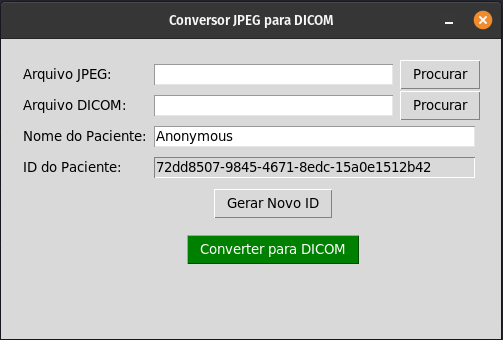

# Orbitex Image to DICOM

Esta aplicação tem como objetivo realizar a conversão de arquivos de imagem e os transforma-los em arquivos DICOM compatíveis
com o projeto Open Source: OHIV Viewer.

## Como usar?

1. Escolha o arquivo de imagem que deseja converter
2. Escolha o diretório no qual o arquivo convertido deve ser salvo
3. Defina um nome para o paciente ou deixe o nome padrão
4. Realize a conversão

